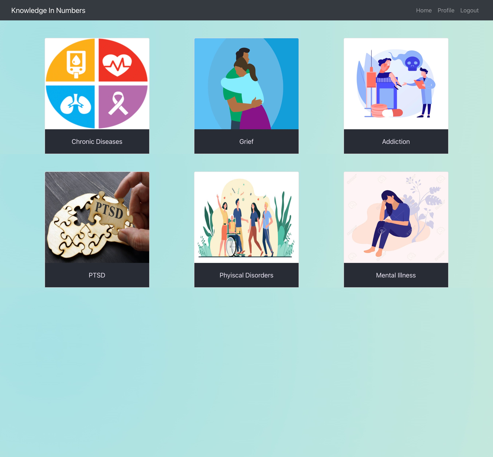
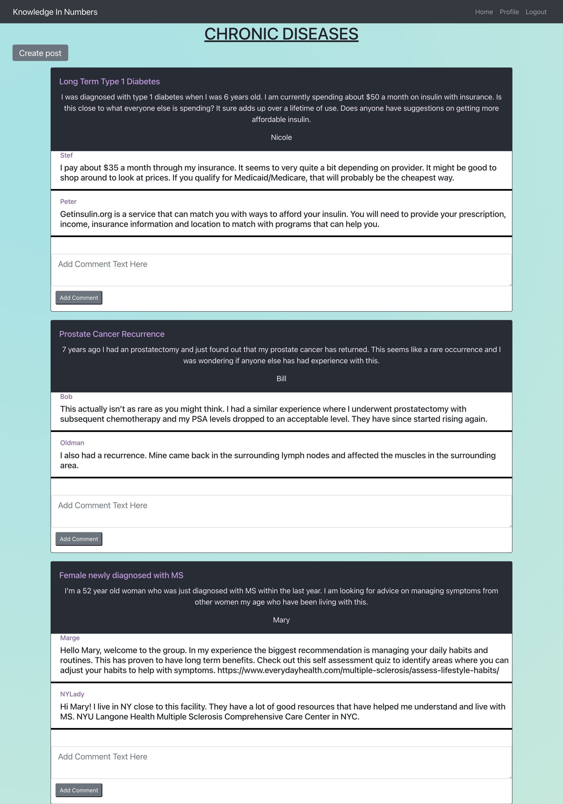

# KIN: Knowledge in Numbers

## Description

Knowledge in Numbers is an a social networking platform for people to connect over difficult life circumstances and experiences. The goal is to provide a safe space for people to share their story and connect with those going through something similar.

The motivation for this project is to create a meaningful application for people to benefit in mental and emotional health. Mental illness awareness is on the rise, and there is a greater need for resources that reach a broad range of people. We created this application with the hope that this can help people feel more connected to their community.

## User story

“AS a person going through an emotionally difficult time, I WANT to share my story and hear other people’s stories who are going through similar experiences SO THAT I can connect to my community and improve my mental health”

## Features

- Login/signup modal for users to create an anonymous user profile
- Hompage with user-friendly design to select a group forum category
- Individual forums for each group (chronic diseases, grief, addiction, mental illness, phyiscal disorders, and PTSD)
- Create post function that on submit, will automatically refresh the page and populate new post
- Delete and edit functions for every post the logged in user has created

## Applications

* MongoDB
* REACT
* GraphQL
* Apollo server
* JWT-decode
* Bootstrap

## Mock Up

## Heroku Deployed link

https://knowledge-in-numbers.herokuapp.com/

## Future Developments

- Add an events page that displays in-person resources in the user’s area
- Have strong security/monitoring of content to ensure a safe and appropriate site
- Separate page to view and make comments
- Edit and delete comments

 ## Developers
 Alviva Faidley, Levi Heintzelman, and Tori Haling
